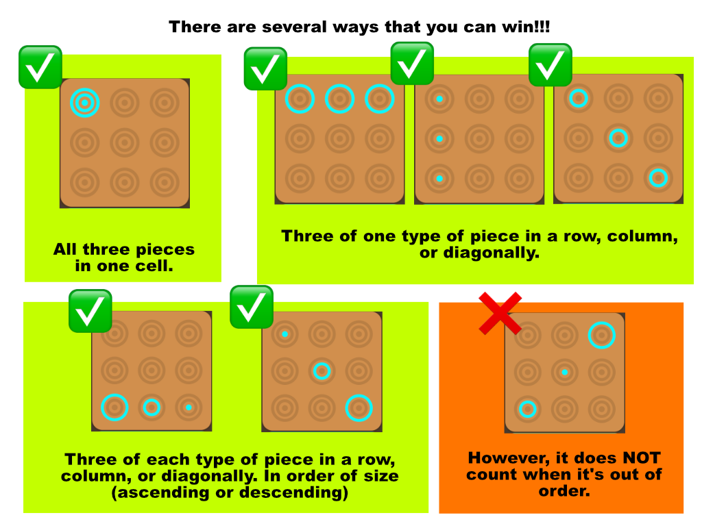

Welcome to O'trio
The three-in-a-row game just got O-so much better, open to 2/4 players Ages 8+;

HOW TO PLAY:
\*For 2 Players:
Each player selects 2 colors that are opposite each other on the board. You can win with either of your color. The youngest will be blue & purple, goes first, and play proceeds clockwise.

\*For 4 Players:
Each player selects a color. The youngest player will be blue, goes first and proceeds clockwise.

For each player's turn:
In O'trio there are 3 pieces:
A peg, and smaller ring and a larger ring.
Each player will have 3 of each piece to begin with. You can check your inventory on your side of the board.

Choose one of 9 cells that you want to put a piece in. If the cell is fully occupied, you won't be able to select that cell. The cell that you want to pick will be highlighted when you hover over it if it's still active, click on the cell to begin setting a piece.

This will bring up the piece selection screen where you can choose a piece to lay down. Any piece that is not available to lay down (whether it is occupied or out of stock) will be grayed out.

Once a piece is placed it cannot be moved.

If a player is unable to play a piece their turn will be skipped (a message will show on the screen indicating that their turn was skipped.)

HOW TO WIN:

Get three-in-an-'O'. AKA an O'trio. There are three different ways to get an Otrio:

1. Three same-sized pieces: large-rings, small-rings, or pegs. Get 3 in a row, column or diagonally.
2. Three pieces in ascending or descending order according to size.
3. Three concentric pieces in the same cell (A peg, a small-ring, and a large-ring, all in the same cell.)

If no player can make anymore moves, it is a draw.

Good luck. And have fun!!!
